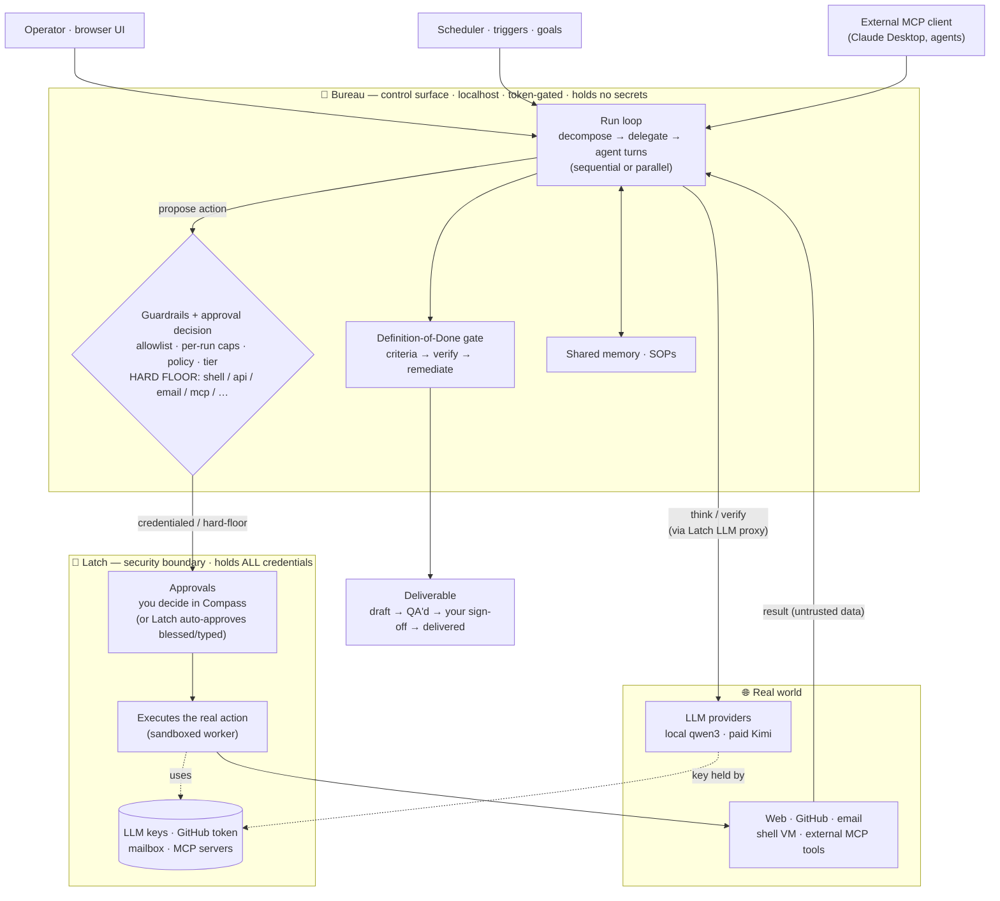
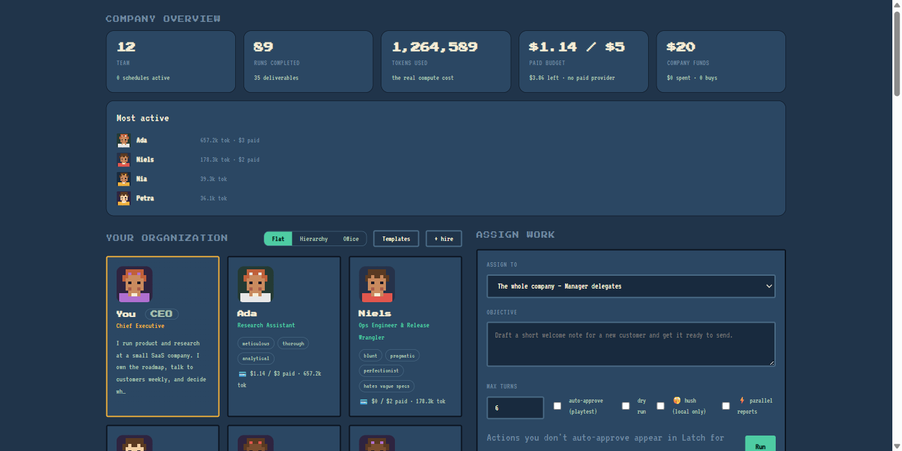
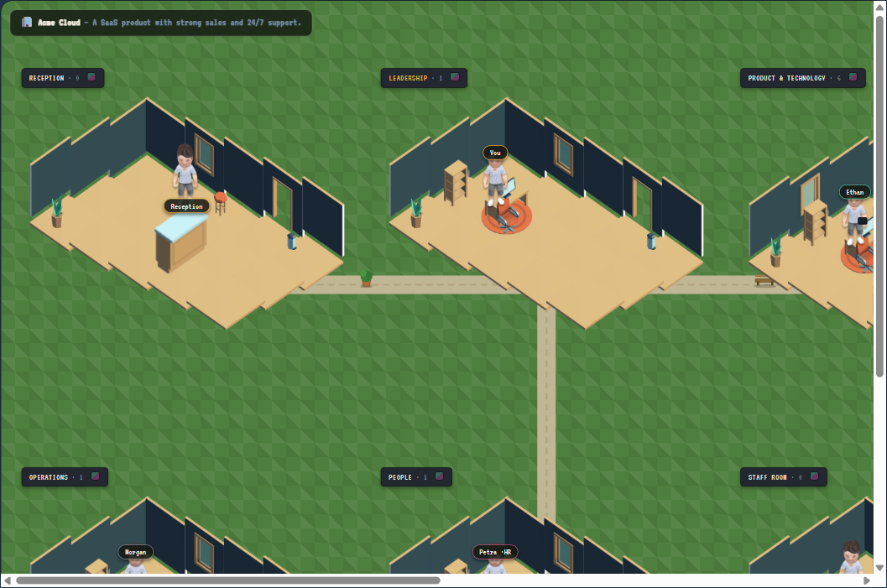

# Bureau

**Hire a company of AI agents, point them at goals, and let them take real, approval-gated actions.**

Bureau is a management-sim orchestrator: you define a CEO and hire agents into a reporting hierarchy,
give the company an objective, and watch it decompose the work, delegate down the org, do it, and QA
its own output against an explicit definition of done — streamed live to a browser UI.

Bureau is the **control surface**; **[Latch](https://github.com/joergensentroels/Latch)** (the
`openclaw-command-center` server) is the **security boundary**: it holds every credential (LLM keys,
GitHub token, mailbox) and executes the risky actions. Bureau *proposes*; Latch *approves and does*.
Bureau stores no secrets.

**Why the floor is the point.** Multi-agent orchestration mostly races toward more autonomy — human
approval is a setting you switch off once you trust the system. Bureau goes the other way: the approval
floor for `shell`, `api_call`, email, repo creation, over-ceiling purchases and external tool calls is
**code, not configuration**. No autonomy tier, policy rule, `autoApprove` flag, or API request can lower
it — and Bureau cannot lower it for itself, because it holds no credentials to act with in the first
place. The hierarchy is the product; the floor is what makes it safe to leave running.

> Single file, **zero dependencies** — Node built-ins only (`node:http`, `node:sqlite`, …).

### Don't take that on faith — run it

No Latch, no model, no network, no state. Works seconds after cloning:

```console
$ node tools/demo-floor.mjs

Bureau — the hard floor is code, not configuration

Sweeping every autonomy tier x policy effect x autoApprove, with a $1,000,000 spend ceiling.
A hard-floored action must require a human in ALL of them.

  action          configurations tried    auto-approved in
  --------------------------------------------------------
  shell           24                      0 — always asks a human
  api_call        24                      0 — always asks a human
  email_draft     24                      0 — always asks a human
  github_repo     24                      0 — always asks a human
  github_pr       24                      0 — always asks a human
  github_issue    24                      0 — always asks a human
  github_comment  24                      0 — always asks a human
  mcp_call        24                      0 — always asks a human

And the gate is not simply always closed:

  web_search      auto-approved           run
  file_write      auto-approved           run
  ask_peer        auto-approved           run

Purchases are floored by the ceiling you set, not by type:

  $4 sticker pack (under the $10 ceiling)   auto-approved
  $40 subscription (over it)                requires you

201 decisions evaluated against the server's own decideApproval().

The floor held in every configuration. No tier, policy or flag can lower it.
```

It sweeps **every** autonomy tier × policy effect × `autoApprove` combination against the same
`decideApproval()` the server runs, and **exits non-zero if any hard-floored action is ever
auto-approved** — so it is a proof and a regression test at once, and the claim above cannot go stale
quietly. The second table matters as much as the first: the gate is selective, not a blanket refusal.

And it cannot be lowered from outside either. The floor lives in `requiresCeoAlways()` in `server.mjs`,
reachable from no API — and Bureau holds no credentials, so even an approval it wrongly granted itself
would have nothing to execute with. Latch does the acting.

---

## How it works



Each agent runs a small loop: **think → propose an action → (approval) → get the result → continue.**
Every real-world action is filed as a Latch approval and either auto-approved (per the agent's autonomy
tier / your policy rules) or decided by you. A **hard floor** — `shell`, `api_call`, `email`, repo
creation, over-ceiling purchases, external tool calls — *always* requires your explicit approval,
regardless of tier or automation. Finished work flows through a draft → QA'd → signed-off → delivered
lifecycle.

_(Low-risk actions Bureau performs directly and safely — versioned draft file writes, and
SSRF-guarded web fetches — while everything credentialed or high-reach goes through Latch as above.)_

## Features

- **Hierarchical delegation** with an automated **Definition-of-Done gate** (derive criteria → work →
  verify → remediate) and a full audit trail.
- **Safe autonomy** — per-agent action allowlists, autonomy tiers, and declarative policy rules, all
  under one inviolable hard floor.
- **Real actions** (all via Latch): web search/fetch, file writes, guarded `api_call`, sandboxed
  `shell`, GitHub publish, purchases.
- **Parallel execution** — run a manager's reports concurrently (opt-in).
- **Mid-run steering** — pause a live run, inject a course-correction, resume.
- **Agent-to-agent comms** — an agent can consult a named teammate (`ask_peer`).
- **Process templates (SOPs)** — reusable, ordered step-lists that run deterministically (skipping the
  LLM planning step).
- **Shared company memory + deliverable RAG** — recall of prior work and past documents across the whole
  team, ranked by **semantic** similarity (local embeddings) fused with **keyword** relevance (BM25) via
  Reciprocal Rank Fusion. Needs `ollama pull nomic-embed-text`; without it, recall degrades cleanly to
  BM25 alone. Retrieval quality is measured, not assumed — `node eval/recall-eval.mjs`.
- **MCP interop** — Bureau speaks the Model Context Protocol both ways: expose it at `POST /mcp` for
  external clients (Claude Desktop, etc.), and let agents call external MCP tools (brokered through Latch).
- **Paid/local model economy** — funded agents use a paid provider (Moonshot/Kimi) with per-agent tiers;
  everyone else stays on the free local model. Per-agent and per-run spend caps.
- **Goals/OKRs, scheduled runs, inbound triggers, notifications**, a persistent **plan/backlog**, and
  **multi-workspace** isolation (each workspace is a separate company).

## Quick start

**Prerequisites**
- **Node 24+** (uses the built-in `node:sqlite`).
- **[Latch](https://github.com/joergensentroels/Latch)** running (default `http://127.0.0.1:8787`) with an
  operator token. Bureau reads the token from Latch's `data/auth.json` (or the `OPERATOR_TOKEN` env var)
  and uses it both to reach Latch and to gate its own API. Latch is a hard requirement, not an optional
  backend — it holds the credentials and executes every risky action, so Bureau does nothing real without
  it. Clone it as `openclaw-command-center` alongside Bureau, or point `LATCH_DATA` at wherever it lives.
- A model provider configured in Latch: a **local** model (e.g. `qwen3:8b` via Ollama) and/or a **paid**
  provider (Moonshot/Kimi).

**Run**
```sh
node server.mjs          # → http://127.0.0.1:4173
```
The API and `/mcp` require the operator token (`Authorization: Bearer <token>`); the browser UI prompts
for it once and remembers it. Bureau binds loopback only.

**Useful env**
| var | default | purpose |
|---|---|---|
| `BUREAU_PORT` | `4173` | listen port |
| `BUREAU_HOST` | `127.0.0.1` | bind host (warns loudly if non-loopback) |
| `LATCH_URL` | `http://127.0.0.1:8787` | Latch base URL |
| `OPERATOR_TOKEN` | — | operator token (else read from Latch's `auth.json`) |
| `BUREAU_READ_TOKEN` | Latch's `agentToken` | read-only token — reads only, no writes |
| `BUREAU_REMOTE` | unset | `1` → Bureau won't **approve** hard-floor actions (deny still works); set it when reachable from a machine you trust less |
| `BUREAU_EMBED_URL` | `http://127.0.0.1:11434` | local embedder for semantic memory (warns if non-loopback) |
| `BUREAU_EMBED_MODEL` | `nomic-embed-text` | embedding model; recall falls back to BM25 if it's missing |
| `BUREAU_TRIGGER_MIN_GAP_MS` | `15000` | minimum gap between two fires of one inbound trigger (retry-storm guard) |
| `LATCH_DATA` | `…/openclaw-command-center/data` | where Latch's `auth.json` lives |
| `BUREAU_LOG` | `<repo>/bureau.log` | stdout+stderr are teed here, size-rotated. `off` disables. Matters most when Bureau runs from a boot task, where a scheduled task captures no output at all |
| `BUREAU_LOG_MAX` / `BUREAU_LOG_KEEP` | `5 MB` / `3` | rotation size and how many generations to keep |
| `BUREAU_BACKUP_ROOT` / `BUREAU_BACKUP_KEEP` | `../_backups` / `14` | where `tools/backup.mjs` writes verified snapshots, and how many to retain. It **refuses** a root inside a git work tree or a cloud-synced folder — snapshots contain the operator token |
| `BUREAU_VERSION_KEEP` | `20` | prior versions retained per deliverable |

## Security

Bureau's API + `/mcp` are token-gated (the Latch operator token, sent in a header — never a query
param), loopback-only, with anti-clickjacking headers, SSRF-guarded outbound fetches, and a damper that
starts refusing an address after repeated bad credentials and writes the attempt to the audit log. The
credential boundary and the hard floor live in Latch. See **[SECURITY.md](SECURITY.md)** for the threat
model, the review findings, and their status.

**Two roles.** The operator token has full control. Latch's narrower `agentToken` grants read-only
access — watch runs live, read deliverables, browse the audit log — and the UI badges itself
`👁 read-only` and says so plainly when a write is refused. Give *that* one to any browser you trust
less.

**Reaching Bureau from another machine** works, but has a sharp edge worth knowing: the operator token
can approve hard-floor approvals, which makes it equivalent to shell access on the Bureau host. So never
expose Bureau directly. Put it behind a private mesh (Tailscale/WireGuard) or an identity-gated tunnel
(Cloudflare Tunnel + Access) — both let Bureau stay bound to loopback — use the read-only token in the
remote browser, and set **`BUREAU_REMOTE=1`** so Bureau refuses to approve anything that always needs a
human (denying still works; you approve those in Compass). See
**[SECURITY.md → Reaching Bureau from another machine](SECURITY.md#reaching-bureau-from-another-machine)**.

**Persist that posture — don't rely on remembering it.** `BUREAU_REMOTE` lives in the environment of
whatever shell starts the process, so if you expose Bureau permanently, starting it the obvious way
(`node server.mjs`) silently gives you an *unguarded* control surface on a reachable hostname. Put the
guard in a start script or service definition so it is the default and disabling it is the thing you have
to type — `Start-Bureau.ps1` in this repo is the Windows version of that, and `-Local` is the opt-out.
A safety posture that vanishes on restart without telling you is worse than no posture at all.

## The UI, and the part I parked

The company view is the one I'm happy with. Team, runs, spend, and every agent with the traits that
shape how they work.



The idea underneath all of this was Theme Hospital. Not a dashboard, a place. A company you watch
running, with staff walking between rooms doing the work, where you can see at a glance that Reception
is idle and Product is buried. There is an isometric office in here that does part of that: a room per
department, staff standing in them, rooms you can drag around to lay out the floor. It's composited
from Kenney's Furniture Kit sprites (CC0).



That's where I stopped, because I'm not great at working with UI yet, and I could feel it becoming the
thing I spent all my time on instead of the parts that make it safe. The bones work. What's missing is
a designer's eye: rooms sit too far apart with dead space between them, nothing moves, and none of the
state an agent is actually in — thinking, blocked, waiting on your approval — shows up in the room.
Making an agent visibly walk to a meeting would do more for understanding a run than any log line.

**If that sounds fun, I'd genuinely welcome the help.** It's self-contained: the office lives in
`officeHTML()` and the isometric drawing helpers in `public/index.html`, and it touches none of the
approval or credential logic, so you can't break the safety properties by working on it. Open an issue
or just have a go and send a PR.

## Known limits

Stated up front rather than left to be discovered:

- **Latch is not optional.** Bureau holds no credentials, so without Latch it can plan, delegate, write
  drafts and fetch pages — and nothing else.
- **One shared token store.** Bureau reuses Latch's operator token; rotating there rotates both. That's
  deliberate (one operator identity for the control plane), but it means **`BUREAU_REMOTE=1` is defence in
  depth, not a boundary** — anyone holding that token can approve directly in Latch wherever Latch is
  reachable.
- **No TLS of its own.** Bureau serves plain HTTP on loopback; confidentiality has to come from the
  transport you put in front of it (mesh VPN or identity-gated tunnel).
- **One endpoint is unauthenticated by design** — inbound webhook triggers, gated by an unguessable token
  in the path, rate-limited, with the caller's payload treated as untrusted input and still clamped by the
  hard floor.
- **The failed-auth damper keys on client identity**, which behind NAT or a proxy that strips
  `x-forwarded-for` collapses to one shared counter. It's an alarm, not a lock.
- **Small local models are unreliable at strict JSON.** There's a retry ladder for it, and the
  JSON-critical planning calls can be routed to a paid tier — but a fully local setup will occasionally
  produce a weaker plan.

Full threat model, review findings and accepted residuals:
**[SECURITY.md](SECURITY.md)** · **[residual risks](SECURITY.md#residual-accepted)**.

## Testing

```sh
node test/run-all.mjs --serve     # pure + server suites (self-hosts a throwaway server)
```
A pre-push hook and GitHub Actions run this on every push. See **[TESTING.md](TESTING.md)** for the
suites, the coverage ledger, and the "tested-or-documented" rule.

## Docs

- **[ROADMAP.md](ROADMAP.md)** — what's shipped and what's next.
- **[SECURITY.md](SECURITY.md)** — security model + review.
- **[TESTING.md](TESTING.md)** — how tests run and what's covered.
- **[GITHUB.md](GITHUB.md)** — one-time setup for GitHub publishing.

## License

**[AGPL-3.0-or-later](LICENSE).** Same license as [Latch](https://github.com/joergensentroels/Latch) —
if you run a modified version as a network service, the modifications have to stay open too.
