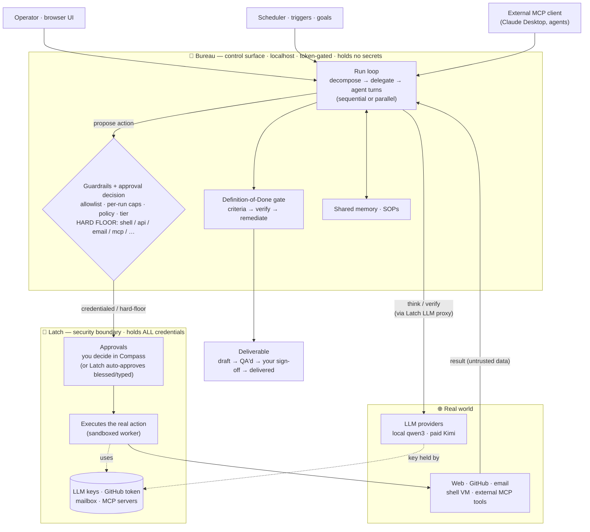

# Bureau

**Hire a company of AI agents, point them at goals, and let them take real, approval-gated actions.**

Bureau is a management-sim orchestrator: you define a CEO and hire agents into a reporting hierarchy,
give the company an objective, and watch it decompose the work, delegate down the org, do it, and QA
its own output against an explicit definition of done — streamed live to a browser UI.

Bureau is the **control surface**; **Latch** (the `openclaw-command-center` server) is the **security
boundary**: it holds every credential (LLM keys, GitHub token, mailbox) and executes the risky actions.
Bureau *proposes*; Latch *approves and does*. Bureau stores no secrets.

> Single file, **zero dependencies** — Node built-ins only (`node:http`, `node:sqlite`, …).

---

## How it works



Each agent runs a small loop: **think → propose an action → (approval) → get the result → continue.**
Every real-world action is filed as a Latch approval and either auto-approved (per the agent's autonomy
tier / your policy rules) or decided by you. A **hard floor** — `shell`, `api_call`, `email`, repo
creation, over-ceiling purchases, external tool calls — *always* requires your explicit approval,
regardless of tier or automation. Finished work flows through a draft → QA'd → signed-off → delivered
lifecycle.

_(Low-risk actions Bureau performs directly and safely — versioned draft file writes, and
SSRF-guarded web fetches — while everything credentialed or high-reach goes through Latch as above.)_

## Features

- **Hierarchical delegation** with an automated **Definition-of-Done gate** (derive criteria → work →
  verify → remediate) and a full audit trail.
- **Safe autonomy** — per-agent action allowlists, autonomy tiers, and declarative policy rules, all
  under one inviolable hard floor.
- **Real actions** (all via Latch): web search/fetch, file writes, guarded `api_call`, sandboxed
  `shell`, GitHub publish, purchases.
- **Parallel execution** — run a manager's reports concurrently (opt-in).
- **Mid-run steering** — pause a live run, inject a course-correction, resume.
- **Agent-to-agent comms** — an agent can consult a named teammate (`ask_peer`).
- **Process templates (SOPs)** — reusable, ordered step-lists that run deterministically (skipping the
  LLM planning step).
- **Shared company memory** — relevance-ranked recall of prior work across the whole team.
- **MCP interop** — Bureau speaks the Model Context Protocol both ways: expose it at `POST /mcp` for
  external clients (Claude Desktop, etc.), and let agents call external MCP tools (brokered through Latch).
- **Paid/local model economy** — funded agents use a paid provider (Moonshot/Kimi) with per-agent tiers;
  everyone else stays on the free local model. Per-agent and per-run spend caps.
- **Goals/OKRs, scheduled runs, inbound triggers, notifications**, a persistent **plan/backlog**, and
  **multi-workspace** isolation (each workspace is a separate company).

## Quick start

**Prerequisites**
- **Node 24+** (uses the built-in `node:sqlite`).
- **Latch** (the `openclaw-command-center` server) running (default `http://127.0.0.1:8787`) with an operator
  token — Bureau reads it from Latch's `data/auth.json` (or the `OPERATOR_TOKEN` env var) and uses it
  both to reach Latch and to gate its own API.
- A model provider configured in Latch: a **local** model (e.g. `qwen3:8b` via Ollama) and/or a **paid**
  provider (Moonshot/Kimi).

**Run**
```sh
node server.mjs          # → http://127.0.0.1:4173
```
The API and `/mcp` require the operator token (`Authorization: Bearer <token>`); the browser UI prompts
for it once and remembers it. Bureau binds loopback only.

**Useful env**
| var | default | purpose |
|---|---|---|
| `BUREAU_PORT` | `4173` | listen port |
| `BUREAU_HOST` | `127.0.0.1` | bind host (warns loudly if non-loopback) |
| `LATCH_URL` | `http://127.0.0.1:8787` | Latch base URL |
| `OPERATOR_TOKEN` | — | operator token (else read from Latch's `auth.json`) |
| `BUREAU_READ_TOKEN` | Latch's `agentToken` | read-only token — reads only, no writes |
| `BUREAU_REMOTE` | unset | `1` → Bureau won't **approve** hard-floor actions (deny still works); set it when reachable from a machine you trust less |
| `LATCH_DATA` | `…/openclaw-command-center/data` | where Latch's `auth.json` lives |

## Security

Bureau's API + `/mcp` are token-gated (the Latch operator token, sent in a header — never a query
param), loopback-only, with anti-clickjacking headers, SSRF-guarded outbound fetches, and a damper that
starts refusing an address after repeated bad credentials and writes the attempt to the audit log. The
credential boundary and the hard floor live in Latch. See **[SECURITY.md](SECURITY.md)** for the threat
model, the review findings, and their status.

**Two roles.** The operator token has full control. Latch's narrower `agentToken` grants read-only
access — watch runs live, read deliverables, browse the audit log — and the UI badges itself
`👁 read-only` and says so plainly when a write is refused. Give *that* one to any browser you trust
less.

**Reaching Bureau from another machine** works, but has a sharp edge worth knowing: the operator token
can approve hard-floor approvals, which makes it equivalent to shell access on the Bureau host. So never
expose Bureau directly. Put it behind a private mesh (Tailscale/WireGuard) or an identity-gated tunnel
(Cloudflare Tunnel + Access) — both let Bureau stay bound to loopback — use the read-only token in the
remote browser, and set **`BUREAU_REMOTE=1`** so Bureau refuses to approve anything that always needs a
human (denying still works; you approve those in Compass). See
**[SECURITY.md → Reaching Bureau from another machine](SECURITY.md#reaching-bureau-from-another-machine)**.

## Testing

```sh
node test/run-all.mjs --serve     # pure + server suites (self-hosts a throwaway server)
```
A pre-push hook and GitHub Actions run this on every push. See **[TESTING.md](TESTING.md)** for the
suites, the coverage ledger, and the "tested-or-documented" rule.

## Docs

- **[ROADMAP.md](ROADMAP.md)** — what's shipped and what's next.
- **[SECURITY.md](SECURITY.md)** — security model + review.
- **[TESTING.md](TESTING.md)** — how tests run and what's covered.
- **[GITHUB.md](GITHUB.md)** — one-time setup for GitHub publishing.
